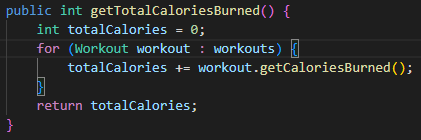
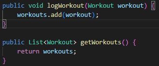
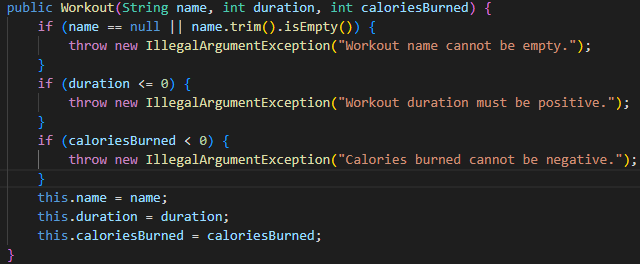

# Simple Java Project with Maven and JUnit

This is a simple Java project that uses Maven for dependency management and JUnit for testing.

## Project Structure

- `pom.xml`: Maven project configuration.
- `src/main/java/com/example/App.java`: Main application class.
- `src/test/java/com/example/AppTest.java`: JUnit test class.

## How to Build and Test

To build the project, run the following command in the terminal:

```bash
mvn compile
```

To run the tests, use the following command:

```bash
mvn test
```

## Project Explanation

This project is a simple command-line fitness tracking application. It allows users to log workouts, set fitness goals, and track their progress.

**How it works:**

- The `App` class is the main entry point and holds the core logic for managing workouts and goals.
- The `Workout` class represents a single workout activity, storing its name, duration, and calories burned.
- The `Goal` class represents a fitness goal, storing its description and whether it has been achieved.

**Test Cases:**
The unit tests are designed to validate the core functionalities of the application:

- `testLogWorkout()`: Ensures that a new workout can be successfully logged.
- `testTrackProgress()`: Checks if the total calories burned from multiple workouts are calculated correctly.
- `testSetGoal()`: Verifies that a new goal can be set.
- `testAchieveGoal()`: Confirms that a goal's status can be updated to "achieved".
- `testInvalidWorkout()`: A negative test case that ensures the application rejects workouts with invalid data (e.g., empty name, negative duration).
- `testInvalidGoal()`: A negative test case that ensures the application rejects goals with an empty description.

## Clean Code Practices

This project adheres to several clean code principles:

1.  **Meaningful Naming:** Classes and methods have clear and descriptive names that reveal their purpose. For example, `getTotalCaloriesBurned()` and `logWorkout()` are self-explanatory, making the code easier to read and understand without needing comments.

2.  **Input Validation:** The constructors for `Workout` and `Goal` validate their input. This prevents the creation of objects with invalid states (e.g., a workout with a negative duration), making the application more robust and preventing errors down the line.

3.  **Single Responsibility Principle (SRP):** Each class has a single, well-defined responsibility. The `Workout` class is only responsible for workout data, the `Goal` class for goal data, and the `App` class for the main application logic. This separation of concerns makes the code easier to maintain and test.

## Screenshots

  

## Dependencies

The primary dependencies for this project are for JUnit 5, which is used for unit testing.

- **`junit-jupiter-api`**: Provides the API for writing tests (e.g., `@Test`, `assertEquals`).
- **`junit-jupiter-engine`**: The engine that actually runs the tests.

These dependencies are automatically downloaded from the **Maven Central Repository**, which is the default repository for Maven projects. They are declared in the `pom.xml` file.
